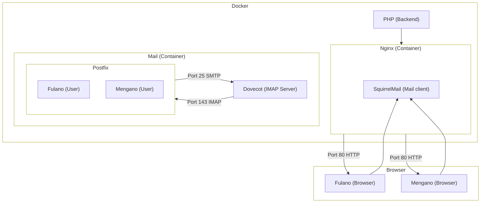

# Mail Server with SquirrelMail


## Introduction

SquirrelMail is a webmail client that allows users to access their email via a web interface. This documentation describes how to deploy SquirrelMail using Docker with separate containers for the application, web server, and mail server.

## Squema

Look at this mermaid squema



## Setup Instructions

### Clone the Repository

```bash
   git clone https://github.com/PumukyDev/squirrelmail.git
   cd squirrelmail
```

### Deploy the servers

```bash
    docker-compose up -d --build
```

## Documentation
